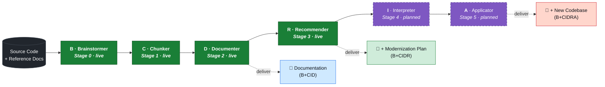
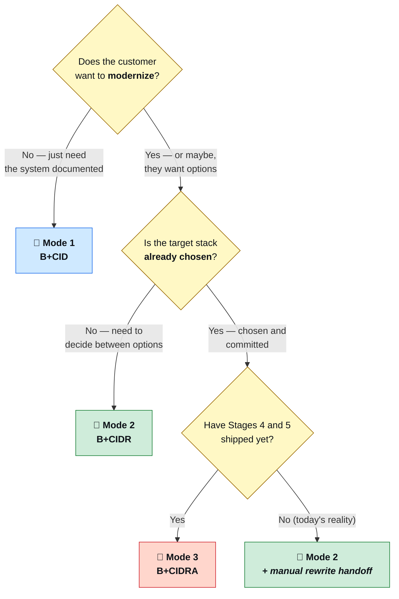

# B+CIDRA — The Process, End to End

> **From legacy source code to a documented, modernized, or rewritten system.**
> One framework. One pipeline. Three scopes. Pick yours.

---

## TL;DR

B+CIDRA is a six-stage pipeline. You start with raw legacy code; you exit at one of three altitudes:

| Exit | Acronym | You leave with | Typical effort |
|:---|:---:|:---|:---:|
| 📘 Stop after Documenter | **B+CID** | Auditable, hallucination-free documentation | hours–days |
| 📗 Stop after Recommender | **B+CIDR** | Documentation + modernization roadmap with ROI | + hours |
| 📕 Run the full pipeline | **B+CIDRA** | Documentation + new generated codebase | + days–weeks |

The first two are **live today.** The last one (I + A) is **on the roadmap**; the framework is architected end-to-end so the data contract from D to R to I to A is already specified.

---

## The whole picture



The diagram reads left-to-right as one pipeline. The dashed outputs on the right are the **exit ramps** — every project leaves through one of them. Stages drawn in dashed purple are designed but not yet implemented.

---

## Pick your scope

Three modes. The mode is a strategic choice made by the customer (with you facilitating), **not** an engineering choice you can decide alone — different stakeholders need different deliverables.

### 📘 Mode 1 — Documentation (B+CID)

```
Source ──► [B] ──► [C] ──► [D] ──► 📘 Docs
```

**Deliverable:** ≥7 Markdown files per documented component, hallucination-free, validated to 100/100, with exact line counts and careful language.

**Use when:**
- The customer asks for a **handover** package (departing vendor → incoming team).
- An **audit** is upcoming and they need verifiable documentation of what the code actually does.
- A system is approaching **end-of-life** and they want institutional knowledge captured before key engineers leave.
- They want to **decide later** about modernization — first establish ground truth.

**Don't pick this mode when:** the customer's question is "should we rewrite this?" — go to Mode 2.

**Typical effort:** Several hours per documented component, scaling with codebase size. Per the chiyuv_yashir project memory: 3 main programs × ~30 min documenter + validation each = one working day for the doc-only deliverable.

---

### 📗 Mode 2 — Documentation + Modernization Plan (B+CIDR)

```
Source ──► [B] ──► [C] ──► [D] ──► [R] ──► 📗 Docs + Roadmap
```

**Deliverable:** Everything from Mode 1, **plus** a `RECOMMENDATION_REPORT.md` that compares modernization paths (rewrite / refactor / replatform), scores each on risk and ROI, and proposes a phased roadmap.

**Use when:**
- The customer is **deciding strategy** — they know the system needs to change, they don't know how.
- A migration **budget request** is going to the steering committee.
- The customer wants **multiple technology options** scored, not a single answer.
- You're proposing the documentation deliverable but want to **upsell** the strategy layer.

**Don't pick this mode when:** they've already committed to a target stack (e.g. "we're moving to SAP S/4HANA, just tell us how") — Recommender wastes effort comparing options nobody will consider. Go to Mode 3 once the I+A stages land, or stop at Mode 1.

**Typical effort:** Mode 1 effort plus ≈ 1–2 hours of Recommender dialog + report generation per component.

---

### 📕 Mode 3 — End-to-End Migration (B+CIDRA)

```
Source ──► [B] ──► [C] ──► [D] ──► [R] ──► [I] ──► [A] ──► 📕 New Codebase
```

**Deliverable:** Everything from Mode 2, **plus** a generated codebase in the chosen target technology, traceable line-by-line back to the source via the Interpreter's intermediate representation.

**Use when:** *(future state — Stages 4 and 5 are not yet implemented; see roadmap section)*
- A modernization decision has been **made** and the customer wants to skip the months of manual rewrite.
- The target stack is **well-bounded** (e.g. AS/400 COBOL → Java Spring + PostgreSQL, ABAP → SAP BTP).
- The customer accepts that **generated code requires human review** before going to production — Applicator delivers a *very strong starting point*, not a press-the-button replacement.

**Don't pick this mode today** — say so honestly. Mode 1 or 2 is what's available; Mode 3 is a 6–12 month roadmap item.

**Typical effort (projected):** Mode 2 effort plus days–weeks per component for I + A, depending on target-stack complexity.

---

## The six stages — one card each

Each stage card is structured the same way. Read top-to-bottom for the project flow.

---

### 🧠 **B** — THE_BRAINSTORMER_AGENT · Stage 0 · `/brainstorm`

> The conversation that prevents the project from going sideways in week 3.

| Status | Required? | Inputs | Outputs | Time |
|:---:|:---:|:---|:---|:---:|
| **🟢 Live** | Yes | Customer answers to 3 questions + inventory of available reference material | `BRAINSTORM_OUTPUT.yaml`, `MISSING_INPUTS.md`, `BRAINSTORM_DIALOG_LOG.md` | 20–40 min |

**What it does.** Asks three pivotal questions — *why are we doing this?*, *who reads the output?*, *how much time do we have?* — then maps the answers to a documentation template, a careful-language policy, and a scoping decision. Inventories provided inputs against 12 standard categories and produces a 🔴/🟡/🟢 gap list that the customer must acknowledge before the pipeline proceeds.

**Why it matters.** Without Stage 0, downstream agents make silent assumptions ("you must have wanted bilingual output", "you must have wanted the audit template"). Stage 0 forces every assumption to be either confirmed or refused. The 5 mandatory rules (`BRN_R1`–`BRN_R5`) are designed around this: no silent goal substitution, no hidden missing inputs, no dual-audience neglect.

**You skip this stage when:** never. Skipping it is the single most common cause of "the deliverable is the wrong shape" complaints from the customer.

---

### 🪓 **C** — THE_CHUNKER_AGENT · Stage 1 · `/chunk`

> Turn 4 million lines of COBOL into LLM-digestible bites without losing the dependency graph.

| Status | Required? | Inputs | Outputs | Time |
|:---:|:---:|:---|:---|:---:|
| **🟢 Live** | Yes | `Source Code/` + `BRAINSTORM_OUTPUT.yaml` | `CHUNKS/repository.json`, `CHUNKS/graph.json`, `CHUNKS/analysis.json`, `CHUNKS/DOCUMENTER_INSTRUCTIONS.md` | ≈1 min per 50k LOC |

**What it does.** Walks every file in `Source Code/`, classifies it by language (AS/400 plugin recognizes CA 2E member naming; SAP plugin recognizes ABAP structure; etc.), partitions into bounded-size chunks that respect language structure (program boundaries, paragraph boundaries, class boundaries), and builds a relationship graph (PERFORM, CALL, COPY, USING).

**Why it matters.** The documenter needs focused context to maintain accuracy. Feeding it a whole 72k-line COBOL program produces hallucination; feeding it the same program as 40 paragraph-sized chunks with the graph metadata produces 100/100 accuracy.

**You skip this stage when:** the source is already small enough to fit in one documenter context (<10 files, <2k LOC total). For everything else, run it.

---

### 📝 **D** — THE_DOCUMENTER_AGENT · Stage 2 · `/document <COMPONENT>`

> The 100/100 box. The deliverable that customers actually look at.

| Status | Required? | Inputs | Outputs | Time |
|:---:|:---:|:---|:---|:---:|
| **🟢 Live** | Yes (in every mode) | `CHUNKS/` + `BRAINSTORM_OUTPUT.yaml` + `DOCUMENTER_PROJECT_CONFIG.yaml` | `Screens/<COMPONENT>/` — 7 Markdown files | 10–30 min per component |

**What it does.** Produces the 7-file documentation package per component: `01_SPECIFICATION.md`, `02_UI_MOCKUP.md`, `03_TECHNICAL_ANALYSIS.md`, `04_BUSINESS_LOGIC.md`, `05_CODE_ARTIFACTS.md`, `README.md`, `VALIDATION_REPORT.md`. Every code reference is cited by exact line number. Every count is verified by `(Get-Content FILE).Count`, never estimated. Every paragraph uses careful language ("appears to", "according to code") so the customer can distinguish observation from interpretation.

**Why it matters.** This is what gets put in front of the steering committee. The five mandatory behavioral rules (`DOC_INT_010`–`DOC_INT_014`) are what make this deliverable defensible under scrutiny: verify before claiming, no assumptions as facts, mandatory verification workflow, honest reporting, anti-hallucination mandate.

**You skip this stage when:** never. Every mode includes it.

**Quality gate.** `/document:validate` runs a 100-point check; target is 100/100; loop with `/document:fix` if below.

---

### 🎯 **R** — THE_RECOMMENDER_AGENT · Stage 3 · `/recommend <COMPONENT>`

> "Given what the code does, here is what you should do about it."

| Status | Required? | Inputs | Outputs | Time |
|:---:|:---:|:---|:---|:---:|
| **🟢 Live** | Optional (Modes 2 & 3 only) | `Screens/<COMPONENT>/` (documenter output) | `RECOMMENDATIONS/<COMPONENT>/RECOMMENDATION_REPORT.md` | 15–30 min per component |

**What it does.** Runs a structured dialog: *what direction does the customer want — rewrite, refactor, replatform?* Then enumerates options against that direction (technology candidates, migration patterns), scores each on risk, effort, and ROI, and recommends a phased roadmap. Produces a technology comparison matrix and a risk assessment.

**Why it matters.** The output is a **decision-support artifact**, not a recommendation in the marketing sense. The customer's CTO can sit with this document and defend the chosen path to the board.

**You skip this stage when:** Mode 1 (documentation-only). The deliverable would be an unanswered question — *should we modernize?* — when the customer just asked for documentation.

---

### 🌐 **I** — THE_INTERPRETER_AGENT · Stage 4 · *(planned)*

> The translation layer between human-readable strategy and machine-actionable spec.

| Status | Required? | Inputs | Outputs | Time |
|:---:|:---:|:---|:---|:---:|
| **🟣 Planned** | Required for Mode 3 | `RECOMMENDATIONS/<COMPONENT>/` + `Screens/<COMPONENT>/` | Per-component **build specification** (IR / DSL — design TBD) | TBD |

**What it will do.** Translate the Recommender's prose recommendation into a structured intermediate representation that the Applicator can act on: data model, behavioral contracts, integration points, business invariants. This is the stage that prevents Applicator from generating plausible-but-wrong code — the IR makes the source-to-target mapping auditable.

**Why it will matter.** Without an explicit IR layer, going from "modernization roadmap" to "generated code" requires the Applicator to silently re-derive the source semantics. That is exactly the hallucination surface area the framework was built to eliminate. Interpreter exists to make that translation explicit and reviewable.

**Status note.** Designed end-to-end in the framework architecture (the registry knows about Stage 4). Implementation has not begun. Customer-facing positioning: "available when both I and A ship; not before."

---

### ⚙️ **A** — THE_APPLICATOR_AGENT · Stage 5 · *(planned)*

> Generate the new codebase. Tag every line with its source-of-truth in the legacy code.

| Status | Required? | Inputs | Outputs | Time |
|:---:|:---:|:---|:---|:---:|
| **🟣 Planned** | Required for Mode 3 | Interpreter IR + target-stack profile | Generated codebase in target tech, with traceability map back to source | TBD |

**What it will do.** Emit the new codebase: source files, test scaffolding, deployment configuration, traceability metadata. Every emitted artifact carries a link back to the legacy code it was derived from, so a human reviewer can verify that line N of the generated Java came from paragraph M of the COBOL source.

**Why it will matter.** Manual rewrite of CA 2E COBOL into modern Java is months of work per program. Applicator compresses that to days, *with a verifiable provenance trail* — the reviewer is not asked to trust "it generated something that looked right"; they are given a map.

**Status note.** Designed but not implemented. Maccabi's parallel C/C++ rewrite track is the natural pilot when this ships.

---

## Mode comparison at a glance

| | 📘 B+CID | 📗 B+CIDR | 📕 B+CIDRA |
|:---|:---:|:---:|:---:|
| **Brainstormer** (Stage 0) | ✅ | ✅ | ✅ |
| **Chunker** (Stage 1) | ✅ | ✅ | ✅ |
| **Documenter** (Stage 2) | ✅ | ✅ | ✅ |
| **Recommender** (Stage 3) | — | ✅ | ✅ |
| **Interpreter** (Stage 4) | — | — | 🟣 |
| **Applicator** (Stage 5) | — | — | 🟣 |
| **Status today** | Live | Live | Roadmap |
| **Customer deliverable** | Documentation package | Documentation + modernization roadmap | Documentation + roadmap + generated code |
| **Time to first draft** | Hours–days | + Hours | + Days–weeks |
| **Best for** | Handover, audit, knowledge preservation | Strategy decisions, budget requests | Committed migrations with bounded target stack |

🟣 = planned, not yet shipped. Disclose this when scoping with the customer.

---

## When to choose which mode — a decision tree



---

## Roadmap status

| Stage | Status | Next milestone |
|:---|:---:|:---|
| B Brainstormer | ✅ Live, v1.1 in use | Continuous refinement based on project feedback |
| C Chunker | ✅ Live, AS/400 + SAP plugins shipped | C/C++ plugin; ABAP CDS plugin |
| D Documenter | ✅ Live, 100/100 validated on RK1 | Plugin parity with chunker |
| R Recommender | ✅ Live | Stronger ROI modeling; integration with Stage 4 IR |
| I Interpreter | 🟣 Designed, not built | First pilot once a Mode-3 customer asks |
| A Applicator | 🟣 Designed, not built | After Interpreter ships |

The pipeline is **architecturally end-to-end**: the data contract between every adjacent pair of stages is specified in `Agents/shared/agent_handoff_protocol.md`. Implementations of I and A will plug into the existing contract without disturbing the live B–C–D–R pipeline.

---

## How this document fits with the others

| Doc | Purpose | Audience |
|:---|:---|:---|
| [`THE_PROCESS.md`](THE_PROCESS.md) | **This document** — strategic overview of the pipeline, mode selection, decision support | Customers, sales conversations, scoping |
| [`RUNBOOK.md`](RUNBOOK.md) | **Step-by-step execution guide** — every command, every flag, every troubleshooting symptom | Developers running the pipeline |
| [`README.md`](README.md) | Repository landing page — what is CIDRA, where do I start | First-time visitors |
| [`QUICK_START.md`](QUICK_START.md) | 5-minute setup recap | Returning users who need a reminder |
| `Agents/shared/agent_handoff_protocol.md` | Inter-agent contract specification | Framework maintainers, plugin authors |

**Reading order for a new B+CIDRA user:**
1. `README.md` — what is this?
2. `THE_PROCESS.md` *(this file)* — what does the whole journey look like?
3. `RUNBOOK.md` — how do I actually run it for my project?

---

## One-line elevator pitches by audience

- **For a CIO who has 30 seconds:** "It documents your legacy code with provable accuracy, and the same pipeline scales up to generating the replacement codebase when you're ready."
- **For a CTO who wants to know if it's real:** "B-C-D-R are running today and producing 100/100 validated documentation on live customer codebases. I-A are designed and on the roadmap; the data contracts are specified so they slot in without disturbing what works."
- **For a project manager asking how long:** "Brainstormer + Chunker + Documenter + Recommender for one component: one working day end-to-end including validation loops. Scales linearly with the number of components."
- **For a developer asking what's under the hood:** "Six specialized agents with structured handoff contracts, file-based pipeline state, strict anti-hallucination rules, and a 100-point validation gate before any output leaves the framework."

---

*B+CIDRA Framework · The Process · v1.0 (2026-06-02)*
*Repository: <https://github.com/iliyaruvinsky/enterprise_cidra_framework>*
